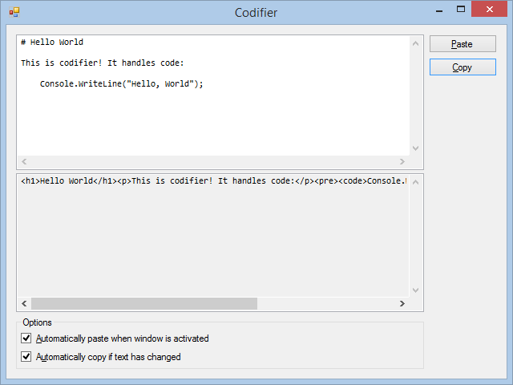

# Codifier, a Markdown generator

This tool creates Community Server compliant HTML right from Markdown. It
handles code by inserting non-blocking spaces and forced line breaks so that it
renders nicely in Community Server.

Yes, it's that sad.

## Code handling

Given the following Markdown:

    # Hello World

    This is codifier! It handles code:

        for (int i = 0; i < 10; i++)
            Console.WriteLine("Hello, World");

Codifier creates the following HTML:

    <h1>Hello World</h1>
    
This is codifier! It handles code:

    <pre><code>for (int i = 0; i &lt; 10; i++) &nbsp;&nbsp;&nbsp;&nbsp;Console.WriteLine(&quot;Hello, World&quot;);</code></pre>
